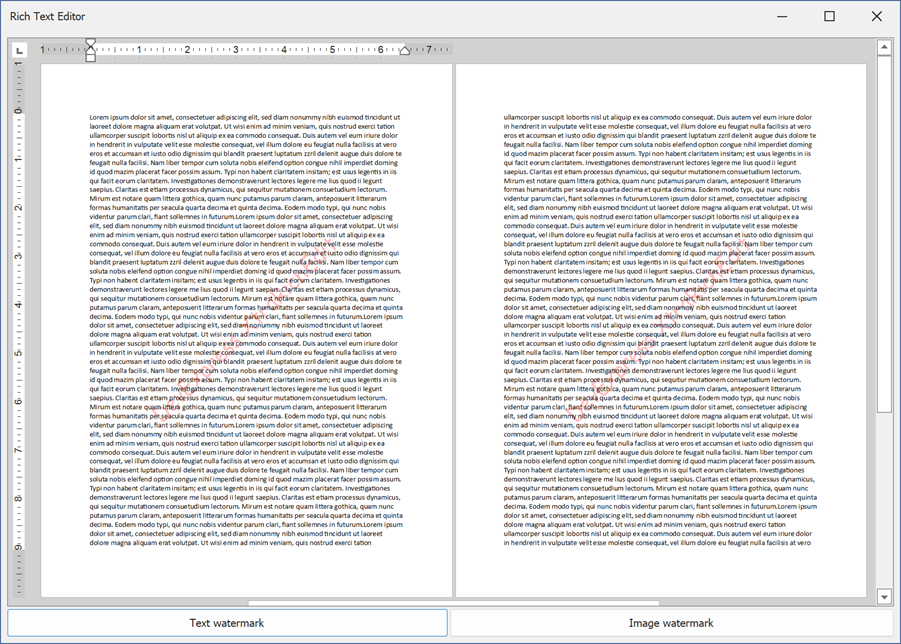

<!-- default badges list -->

<!-- default badges end -->

# How to: Add a Text or Image Watermark to a Document

This example illustrates how you can add a watermark to a separate document section. The Rich Text Editor ships with the [WatermarkManager](https://docs.devexpress.com/OfficeFileAPI/DevExpress.XtraRichEdit.API.Native.WatermarkManager) that allows you to add text or image watermarks. This class is used to insert watermarks by a button click.

> **Tip**
>
> You can also use the [ShapeCollection]() to insert watermarks. Call the [InsertTextWatermark](https://docs.devexpress.com/OfficeFileAPI/DevExpress.XtraRichEdit.API.Native.ShapeCollection.InsertTextWatermark.overloads) to insert a text watermark. The [InsertImageWatermark](https://docs.devexpress.com/OfficeFileAPI/DevExpress.XtraRichEdit.API.Native.ShapeCollection.InsertImageWatermark.overloads) allows you to add an image watermark.

## Files to Review

* [Form1.cs](./CS/Form1.cs) (VB: [Form1.vb](./VB/Form1.vb))
* [StringSample.cs](./CS/StringSample.cs) (VB: [StringSample.vb](./VB/StringSample.vb))

## Documentation

[Watermarks](https://docs.devexpress.com/OfficeFileAPI/403030/word-processing-document-api/word-processing-document/watermarks)
<!-- feedback -->
## Does this example address your development requirements/objectives?

 

(you will be redirected to DevExpress.com to submit your response)
<!-- feedback end -->
